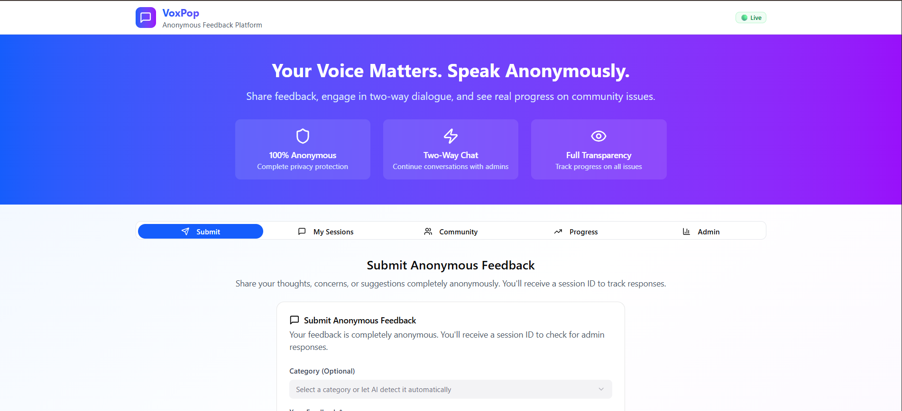
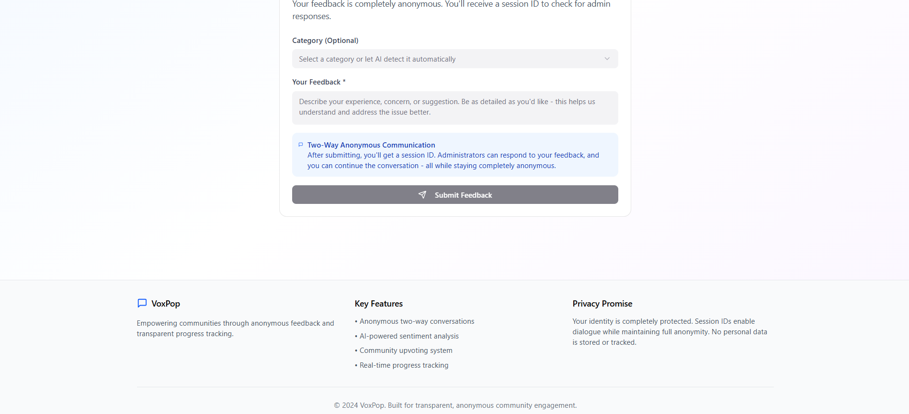
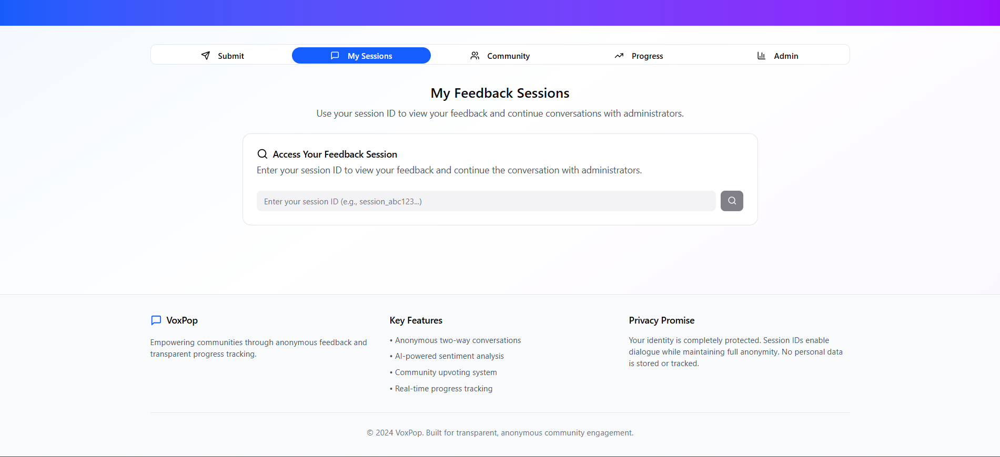
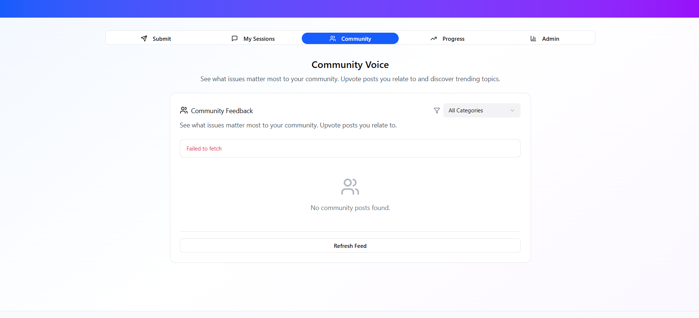
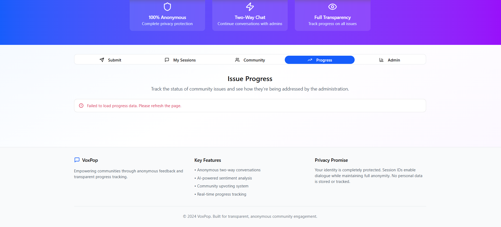
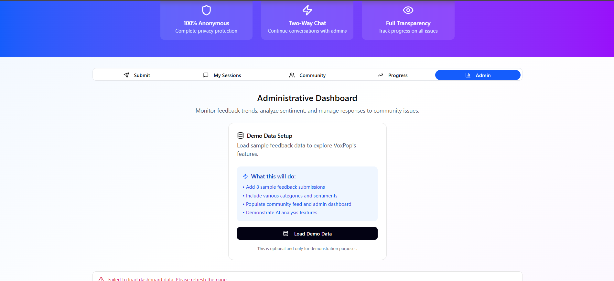

# 🚀 VoxPop - Anonymous Feedback Platform

## 📌 Project Overview
VoxPop is an anonymous feedback platform that enables users to share honest opinions, feedback, and thoughts without revealing their identity. The platform is designed to encourage open communication and community interaction in a safe and anonymous environment.
---

## 🏆 Hackathon Details

This project was developed during:

**Innoverse Tech Fest (August 2025)**  
Organized by **Xavier's Techbyte Society**

It was built as a **team project during the hackathon**.
---

## ⚙️ Features Implemented

### 📝 Anonymous Feedback Submission
- Users can submit feedback without revealing identity
- Simple and clean input interface
---

### 🌍 Community Feed
- Displays feedback submitted by users
- Allows users to view public opinions and discussions
---

### 💬 Anonymous Chat System
- Users can interact through anonymous chat
- Real-time or simulated chat interface (based on implementation)
---

### 📊 Admin Dashboard
- Admin panel to monitor platform activity
- View submitted feedback and manage data
---

### 🎨 Modern UI
- Built with React components
- Responsive and clean design using modern UI practices
---

## 🛠️ Tech Stack

### Frontend:
- React (with TypeScript)
- Vite

### UI:
- Component-based architecture
- Tailwind CSS / custom UI components

### Backend / Database:
- Supabase (for database and backend services)
---

## 📸 Screenshots

### 🏠 Home Page

---

### 📝 Submit Feedback

---

### 📂 My Sessions

---

### 🌍 Community Feed

---

### 📊 Progress Tracking

---

### ⚙️ Admin Dashboard


## 📂 Project Structure
```
VoxPop-Anonymous-Feedback-Platform/
│
├── assets/                     # Screenshots for README
│   ├── homepage.png
│   ├── submit-feedback.png
│   ├── my-sessions.png
│   ├── community.png
│   ├── progress.png
│   └── admin-dashboard.png
│
├── public/                     # Static files
│   └── favicon.ico
│
├── src/                        # Main source code
│
│   ├── components/             # Reusable UI components
│   │   ├── AdminDashboard.tsx
│   │   ├── AnonymousChat.tsx
│   │   ├── CommunityFeed.tsx
│   │   ├── FeedbackSubmission.tsx
│   │   └── ui/                 # UI elements (buttons, cards, etc.)
│
│   ├── pages/                  # Page-level components (if used)
│   │   ├── Home.tsx
│   │   ├── Sessions.tsx
│   │   ├── Community.tsx
│   │   ├── Progress.tsx
│   │   └── Admin.tsx
│
│   ├── services/               # API / backend calls
│   │   └── supabaseClient.ts
│
│   ├── utils/                  # Helper functions
│   │   └── helpers.ts
│
│   ├── types/                  # TypeScript types/interfaces
│   │   └── index.ts
│
│   ├── App.tsx                 # Main app component
│   ├── main.tsx                # Entry point
│   └── index.css               # Global styles
│
├── .gitignore
├── package.json
├── tsconfig.json
├── vite.config.ts
├── README.md                   # Project documentation
└── LICENSE (optional)
```
---

## ▶️ How to Run the Project
bash
```
npm install
npm run dev
```
---

## 📌 Note
This project was developed as a collaborative effort during the hackathon.  
Further improvements and enhancements may be added in the future.
